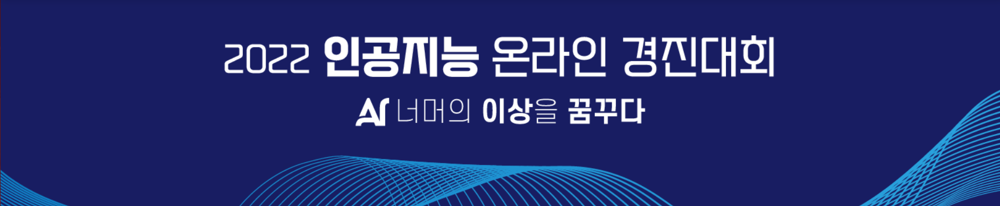

# 

[2022년 인공지능 온라인 경진대회](https://aichallenge.or.kr/competition/detail/1)


# 과제설명

✔ 차량 카메라의 이미지에서 이동체를 검출(Object Detection)하는 문제

### **추진배경**

✔ 최근 자율주행 및 자율주차 기술이 각광받으면서 인공지능 기반 주행 환경 인식 기술의 필요성이 높아짐

✔ 안전을 위해 어린이, 유모차 등 주의가 필요한 객체를 정확히 검출하는 인공지능 기술 개발 필요

### **활용 서비스**

✔ 위험 이동체 감지 경보 시스템

✔ 자율 주차 시스템

## 제한 사항
1. 2022년 5월 9일 이전까지 온라인에 공개된 pretrained weight는 사용 가능
2. 제공된 학습 데이터 외에 다른 외부 데이터 사용 불가
3. 팀별 제출 횟수는 시간 당 1회로 제한
4. 재현 서버 환경에서 제한된 시간 내에 학습(36시간) 및 추론(3시간)이 재현되어야 함
5. Test 이미지에 대한 추론은 학습된 모델을 통하여 각 이미지 별로 독립적으로 이루어져야 함

# 데이터 설명

**Input** 

✔ 차량 카메라로 촬영한 이미지(FHD)

✔ Coco Data format

**Output**

✔ 객체의 bounding box 좌표 및 클래스

**Class 종류**

✔ 객체의 14개 클래스

✔ classes = ('세단(승용차)', 'SUV', '승합차', '버스', '학원차량(통학버스)', '트럭', '택시', '성인', '어린이', '오토바이', '전동킥보드', '자전거', '유모차', '쇼핑카트')


### **Submission 양식**

✔ COCO Result 형식으로 작성하여 JSON (utf8) 파일로 제출 ****(sample_submssion 양식은 대회 시작 때 제공)

✔ 각 Object를 dictionary 형태로 기입, dictionary 의 집합을 list 내에 저장하여 제출 (예: [{object_1},{object_2}...])

✔ Segmentation 항목의 경우 빈 list [] 로 통일

✔ 한 이미지당 Object는 50개를 초과하지 않음 (50개 초과 시 Confidence Score를 기준으로 상위 50개만 채점 반영)

```
{
   “image_id”: 파일 이름과 매칭되는 이미지 고유 ID,
   “category_id”: Object 카테고리, 1번부터 14번까지 존재,
   “bbox”: [
       좌상단 x좌표,
       좌상단 y좌표,
       BBOX의 width,
       BBOX의 height
   ],
   “score”: Confidence Score,
   “segmentation”: 빈 리스트 [] 로 통일하여 기재
}
```


# 구현
## 실험

* 모델 : faster rcnn , cacade rcnn 

* 프레임 워크 : mmdetection, pytorch 

* Train Result : train.log

* 평가지표

  * IoU(Intersection over Union) : 객체 탐지 여부 판별을 위한 threshold 0.75 설정
  * mAP(Mean Average Precision) 
    * 0.0192291984 

  ![[크기변환]output](./resource/result.png)


